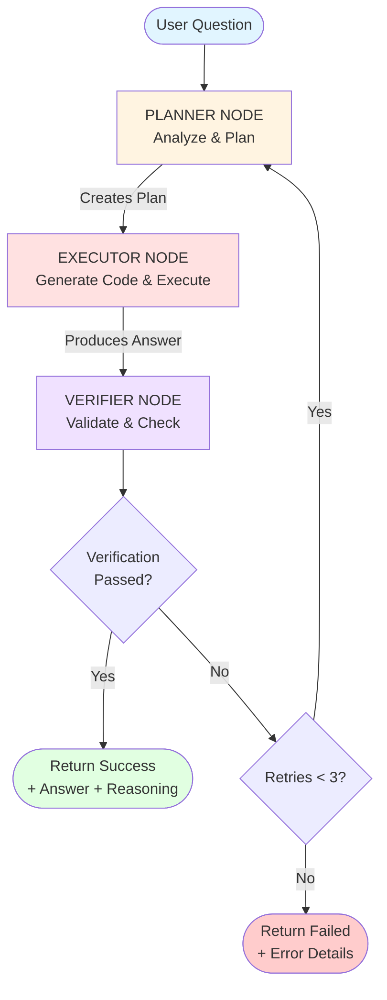
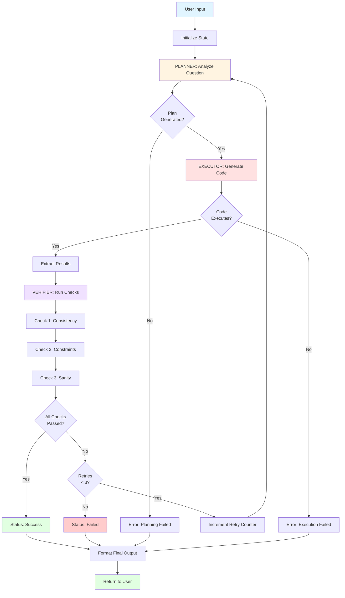

# 🧠 Multi-Step Reasoning Agent

An intelligent AI agent built with LangGraph and OpenAI that solves complex word problems through structured planning, code execution, and self-verification with automatic retry mechanism.

## 📋 Table of Contents

- [Overview](#overview)
- [Architecture](#architecture)
- [Workflow Diagram](#workflow-diagram)
- [Features](#features)
- [Installation](#installation)
- [Usage](#usage)
- [Project Structure](#project-structure)
- [How It Works](#how-it-works)
- [Configuration](#configuration)
- [Examples](#examples)
- [Troubleshooting](#troubleshooting)

## 🎯 Overview

This Multi-Step Reasoning Agent uses a graph-based approach powered by LangGraph to solve complex problems through:
1. **Planning** - Breaking down problems into structured steps
2. **Execution** - Generating and running Python code
3. **Verification** - Validating results with consistency checks
4. **Retry Logic** - Automatic retries with feedback (up to 3 attempts)

**Key Capabilities:**
- 🎯 Structured problem decomposition
- 💻 Safe Python code execution
- ✅ Multi-check verification system
- 🔄 Intelligent retry with feedback
- 📊 Complete execution transparency

## 🏗️ Architecture

The agent consists of three specialized nodes orchestrated by LangGraph:

| Node | Responsibility | Output |
|------|---------------|--------|
| **Planner** | Analyzes question and creates step-by-step plan | Numbered execution steps |
| **Executor** | Generates Python code following the plan | Code + intermediate results + answer |
| **Verifier** | Validates answer through multiple checks | Pass/fail verdict + check details |

### Agent Flow

```
User Question → Planner → Executor → Verifier → Decision
                   ↑                              ↓
                   └──────── Retry (if failed) ───┘
```

## 🔄 Workflow Diagram



### Detailed Execution Flow



## ✨ Features

### 🎯 Intelligent Planning
- Breaks down complex problems into numbered steps
- Avoids premature calculations
- Creates executable roadmaps
- Example format: `step-1: Parse input`, `step-2: Calculate`, etc.

### 💻 Code Generation & Execution
- Generates self-contained Python code
- Executes in isolated environment
- Captures intermediate results
- Extracts final answer automatically

### ✅ Multi-Layer Verification
- **Consistency Check**: Validates logical coherence
- **Constraint Check**: Ensures problem constraints are satisfied
- **Sanity Check**: Verifies reasonableness of results
- Provides detailed check results

### 🔄 Smart Retry Mechanism
- Automatically retries on verification failure
- Maximum 3 retry attempts
- Learns from previous failures
- Graceful degradation on max retries

### 📊 Complete Transparency
- Displays plan, code, and checks
- Shows reasoning for users
- Tracks retry count
- Debug metadata available

## 🚀 Installation

### Prerequisites

- Python 3.9 or higher
- OpenAI API key

### Setup Steps

1. **Clone the repository**
   ```bash
   git clone https://github.com/yourusername/Multi-Step_Reasoning_Agent.git
   cd Multi-Step_Reasoning_Agent
   ```

2. **Create a virtual environment** (recommended)
   ```bash
   # Windows
   python -m venv venv
   venv\Scripts\activate

   # macOS/Linux
   python3 -m venv venv
   source venv/bin/activate
   ```

3. **Install dependencies**
   ```bash
   pip install streamlit
   pip install langgraph
   pip install langchain-openai
   pip install python-dotenv
   ```

   Or use requirements.txt:
   ```bash
   pip install -r requirements.txt
   ```

4. **Configure environment variables**
   
   Create a `.env` file in the project root:
   ```env
   OPENAI_API_KEY=your_openai_api_key_here
   ```

### Creating requirements.txt

If you need to create the requirements file:

```txt
streamlit==1.29.0
langgraph==0.0.20
langchain-openai==0.0.5
langchain-core==0.1.10
python-dotenv==1.0.0
```

## 💻 Usage

### Running the Application

Start the Streamlit interface:

```bash
streamlit run agent.py
```

The application will open at `http://localhost:8501`

### Using the Agent

1. **Enter your question** in the text input field
   ```
   Example: "If a train leaves at 14:30 and arrives at 18:05, how long is the journey?"
   ```

2. **Click "Solve"** to start the reasoning process

3. **View results:**
   - ✅ Final answer
   - Status (success/failed)
   - User-friendly reasoning
   - Expandable metadata (plan, code, checks, retries)

### Special Commands

- **Type "graph"** - Visualize the agent workflow
- **Type "quit", "exit", or "q"** - Exit the application

### Command Line Options

```bash
# Run on custom port
streamlit run agent.py --server.port 8502

# Enable debug mode
streamlit run agent.py --logger.level=debug
```

## 📁 Project Structure

```
Multi-Step_Reasoning_Agent/
│
├── agent.py              # Main Streamlit application
├── graph.py              # LangGraph workflow definition
├── state.py              # State management (TypedDict)
├── prompts.py            # LLM prompts for each node
├── utils.py              # Helper functions (execution, state creation)
├── config.py             # Configuration settings
├── .env                  # Environment variables (API keys)
├── requirements.txt      # Python dependencies
└── README.md            # Project documentation
```

### File Descriptions

| File | Purpose |
|------|---------|
| **agent.py** | Streamlit UI and user interaction handling |
| **graph.py** | Defines nodes (planner, executor, verifier) and graph structure |
| **state.py** | AgentState TypedDict defining data flow between nodes |
| **prompts.py** | Engineered prompts for planner, executor, and verifier |
| **utils.py** | Code execution, state initialization, and retry logic |
| **config.py** | API keys, model selection, and retry limits |

## 🔍 How It Works

### 1. Planning Phase (Planner Node)

**Input:** User question

**Process:**
- Receives the question
- Analyzes problem structure
- Creates numbered step-by-step plan
- **Does NOT solve** - only plans

**Output Example:**
```
Question: If a train leaves at 14:30 and arrives at 18:05, how long is the journey?

Plan:
step-1: Parse departure and arrival times
step-2: Convert times to minutes
step-3: Compute time difference
step-4: Convert result to hours and minutes
step-5: Prepare final answer
```

### 2. Execution Phase (Executor Node)

**Input:** Question + Plan

**Process:**
- Follows the plan exactly
- Generates self-contained Python code
- Executes code in isolated environment
- Captures intermediate results
- Extracts final answer

**Output Example:**
```python
# Generated code
departure_hour = 14
departure_min = 30
arrival_hour = 18
arrival_min = 5

departure_total_min = departure_hour * 60 + departure_min
arrival_total_min = arrival_hour * 60 + arrival_min
difference_min = arrival_total_min - departure_total_min

hours = difference_min // 60
minutes = difference_min % 60

result = f"{hours} hours and {minutes} minutes"
```

**Final Answer:** "3 hours and 35 minutes"

### 3. Verification Phase (Verifier Node)

**Input:** Question + Final Answer + Intermediate Results

**Process:**
- Independently verifies correctness
- Runs multiple checks:
  - **Consistency Check**: Answer matches calculations
  - **Constraint Check**: Satisfies problem requirements
  - **Sanity Check**: Result is reasonable

**Output Example:**
```json
{
  "reasoning_visible_to_user": "Calculated time difference between 14:30 and 18:05",
  "verification": "passed",
  "checks": [
    {
      "check_name": "consistency check",
      "passed": true,
      "details": "Time calculation is mathematically correct"
    },
    {
      "check_name": "constraint validation",
      "passed": true,
      "details": "Arrival time is after departure time"
    }
  ]
}
```

### 4. Retry Logic (Conditional Edge)

**Decision Function:**
```python
if verification == "passed":
    return "success"
elif retries < MAX_RETRIES (3):
    retries += 1
    return "retry"  # Go back to planner
else:
    return "failed"
```

**Retry Benefits:**
- Gives agent chance to self-correct
- Learns from verification feedback
- Improves success rate

## ⚙️ Configuration

### Environment Variables (`.env`)

```env
OPENAI_API_KEY=sk-...           # Your OpenAI API key (required)
```

### Configuration Parameters (`config.py`)

```python
OPENAI_API_KEY = os.getenv("OPENAI_API_KEY", "")
MODEL_NAME = "gpt-4o-mini"      # OpenAI model
MAX_RETRIES = 3                 # Maximum retry attempts
```

### Customization

**Change LLM Model:**
```python
# In config.py
MODEL_NAME = "gpt-4"  # Use more powerful model
```

**Adjust Retry Behavior:**
```python
# In config.py
MAX_RETRIES = 5  # Allow more attempts
```

**Modify Temperature:**
```python
# In graph.py
llm = ChatOpenAI(
    model=config.MODEL_NAME, 
    api_key=config.OPENAI_API_KEY,
    temperature=0.2  # Add some creativity (default is 0)
)
```

## 📝 Examples

### Example 1: Time Calculation

**Input:**
```
If a train leaves at 14:30 and arrives at 18:05, how long is the journey?
```

**Agent Process:**

**Planner:**
```
step-1: Parse departure and arrival times
step-2: Convert times to minutes
step-3: Compute time difference
step-4: Convert result to hours and minutes
step-5: Prepare final answer
```

**Executor:**
```python
departure_total_min = 14 * 60 + 30  # 870
arrival_total_min = 18 * 60 + 5      # 1085
difference_min = 1085 - 870           # 215
hours = 215 // 60                     # 3
minutes = 215 % 60                    # 35
result = "3 hours and 35 minutes"
```

**Verifier:**
```json
{
  "verification": "passed",
  "checks": [
    {"check_name": "consistency check", "passed": true},
    {"check_name": "constraint validation", "passed": true}
  ]
}
```

**Output:**
```
✅ Final Answer: 3 hours and 35 minutes
Status: success
Reasoning: Calculated time difference between departure and arrival
Retries: 0
```

### Example 2: Counting Problem

**Input:**
```
Alice has 3 red apples and twice as many green apples. How many apples total?
```

**Planner:**
```
step-1: Identify number of red apples
step-2: Compute green apples using constraint
step-3: Sum total apples
step-4: Prepare final answer
```

**Executor:**
```python
red = 3
green = 2 * red  # 6
total = red + green  # 9
result = total
```

**Output:**
```
✅ Final Answer: 9
Status: success
Reasoning: Red apples = 3, Green apples = 2 × 3 = 6, Total = 9
Retries: 0
```

### Example 3: Complex Logic

**Input:**
```
A meeting starts at 10:15 AM and lasts 2 hours 45 minutes. What time does it end?
```

**Planner:**
```
step-1: Parse start time
step-2: Parse duration
step-3: Add duration to start time
step-4: Handle hour overflow if necessary
step-5: Prepare final answer
```

**Executor:**
```python
start_hour = 10
start_min = 15
duration_hour = 2
duration_min = 45

total_min = start_min + duration_min  # 60
extra_hour = total_min // 60          # 1
final_min = total_min % 60            # 0
final_hour = start_hour + duration_hour + extra_hour  # 13

result = f"{final_hour}:{final_min:02d}"
```

**Output:**
```
✅ Final Answer: 13:00
Status: success
Reasoning: Added duration to start time with proper hour handling
Retries: 0
```

## 🐛 Troubleshooting

### Common Issues

**Issue 1: "OpenAI API key not found"**
```
Error: API key not configured

Solution:
1. Create .env file in project root
2. Add: OPENAI_API_KEY=your_actual_key_here
3. Restart the application
```

**Issue 2: "Planning failed"**
```
Error: Could not generate plan

Solution:
- Ensure question is clear and well-formed
- Try rephrasing the question
- Check API key validity
- Verify internet connection
```

**Issue 3: "Code execution error"**
```
Error: Code failed to execute

Solution:
- Check generated code in metadata
- May need to retry (automatic)
- Ensure question has logical solution
```

**Issue 4: "Verification keeps failing"**
```
Error: Failed after 3 retries

Solution:
- Question might be too ambiguous
- Check verification details in metadata
- Try simplifying the question
- Increase MAX_RETRIES in config.py
```

**Issue 5: "Module not found"**
```
Error: No module named 'langgraph'

Solution:
pip install langgraph langchain-openai streamlit python-dotenv
```

## 🎓 Advanced Usage

### Viewing the Graph

Type **"graph"** in the question field to visualize the workflow:

```
User → Planner → Executor → Verifier → Decision
         ↑                              ↓
         └──────── Retry Loop ──────────┘
```

### Debugging Failed Attempts

Expand the **"Show Metadata"** section to see:
- Complete generated plan
- Python code that was executed
- All verification checks with pass/fail
- Number of retry attempts

### Extending the Prompts

**Add domain-specific examples:**

Edit `prompts.py`:
```python
# In PLANNER_PROMPT
Q: [Your domain-specific question]
Plan:
step-1: [Domain-specific step]
...
```

**Modify verification checks:**

Edit `prompts.py` VERIFIER_PROMPT:
```python
# Add new check types
"checks": [
    {
        "check_name": "domain_constraint_check",
        "passed": true/false,
        "details": "Custom validation"
    }
]
```

## 🔐 Security

### Code Execution Safety

The current implementation uses Python's `exec()` function. For production:

**Recommendations:**
1. Use sandboxed execution environment
2. Limit allowed imports
3. Set execution timeout
4. Validate code before execution
5. Log all executions

**Example Safe Execution:**
```python
import signal

def timeout_handler(signum, frame):
    raise TimeoutError("Execution timeout")

signal.signal(signal.SIGALRM, timeout_handler)
signal.alarm(5)  # 5-second timeout

try:
    exec(code, safe_namespace, local_env)
finally:
    signal.alarm(0)
```

## 📈 Performance

### Typical Execution Times

| Problem Type | Avg Time | Retries |
|-------------|----------|---------|
| Simple arithmetic | 3-5 sec | 0 |
| Time calculations | 4-6 sec | 0-1 |
| Complex logic | 5-8 sec | 1-2 |

### Optimization Tips

1. **Use faster model** for simple queries:
   ```python
   MODEL_NAME = "gpt-3.5-turbo"
   ```

2. **Cache frequent patterns** (future enhancement)

3. **Reduce retry limit** for faster failure:
   ```python
   MAX_RETRIES = 1
   ```

## 🤝 Contributing

Contributions are welcome! Here's how:

1. Fork the repository
2. Create feature branch (`git checkout -b feature/AmazingFeature`)
3. Commit changes (`git commit -m 'Add AmazingFeature'`)
4. Push to branch (`git push origin feature/AmazingFeature`)
5. Open Pull Request

### Development Guidelines

- Follow PEP 8 style guide
- Add docstrings to functions
- Test with various question types
- Update README for significant changes

## 🗺️ Roadmap

- [ ] Add sandboxed code execution
- [ ] Support for mathematical expressions (SymPy)
- [ ] Implement conversation memory
- [ ] Add more verification check types
- [ ] Export reasoning traces
- [ ] Support for image-based problems
- [ ] Integration with WolframAlpha
- [ ] API endpoint for programmatic access
- [ ] Multi-language support

## 📄 License

This project is open source and available under the MIT License.

## 👨‍💻 Authors

**Vijaya Raghava Medarametla**
- GitHub: [@VijayaRaghava139](https://github.com/VijayaRaghava139)
- Email: intothedatascience

## 🙏 Acknowledgments

- **LangGraph** team for the graph framework
- **OpenAI** for GPT models
- **Streamlit** for the UI framework
- **LangChain** community for documentation

## 📚 References

- [LangGraph Documentation](https://langchain-ai.github.io/langgraph/)
- [OpenAI API Documentation](https://platform.openai.com/docs)
- [Streamlit Documentation](https://docs.streamlit.io)
- [LangChain Documentation](https://python.langchain.com/)

---

⭐ **If you find this project useful, please give it a star on GitHub!**

💡 **Questions or feedback?** Open an issue or reach out via email.

🚀 **Ready to solve complex problems with structured AI reasoning!**
