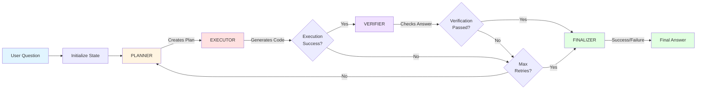
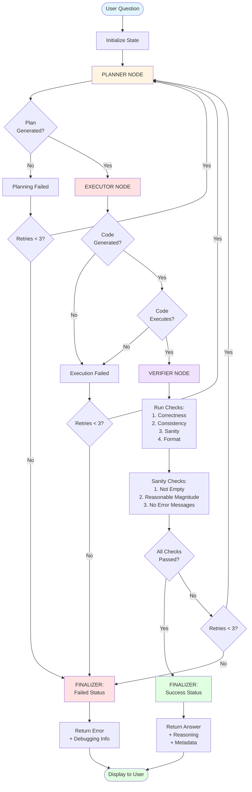

# 🧠 Multi-Step Reasoning Agent

A sophisticated AI agent built with LangGraph that solves complex word problems through structured multi-step reasoning, code execution, and self-verification.

## 📋 Table of Contents

- [Overview](#overview)
- [Architecture](#architecture)
- [Workflow Diagram](#workflow-diagram)
- [Detailed Flowchart](#detailed-flowchart)
- [Features](#features)
- [Installation](#installation)
- [Usage](#usage)
- [Project Structure](#project-structure)
- [How It Works](#how-it-works)
- [Configuration](#configuration)
- [Examples](#examples)
- [Troubleshooting](#troubleshooting)

## 🎯 Overview

This Multi-Step Reasoning Agent employs a graph-based approach to solve complex problems by breaking them down into structured steps. The agent plans, executes Python code, verifies results, and iteratively improves until reaching a validated solution.

**Key Capabilities:**
- 🎯 Structured problem decomposition
- 💻 Safe Python code generation and execution
- ✅ Self-verification with multiple quality checks
- 🔄 Automatic retry mechanism with error correction
- 📊 Comprehensive debugging and metadata tracking

## 🏗️ Architecture

The agent is built on **LangGraph**, a framework for creating stateful, multi-agent workflows. It consists of four specialized nodes that work together in a cyclic graph:

| Node | Role | Responsibility |
|------|------|----------------|
| **Planner** | Problem Analysis | Breaks down the question into logical steps |
| **Executor** | Solution Generation | Writes and executes Python code to solve the problem |
| **Verifier** | Quality Assurance | Validates the answer through multiple checks |
| **Finalizer** | Result Consolidation | Prepares the final output with reasoning |

## 🔄 Workflow Diagram



### Workflow Explanation

1. **User Input**: Question is received and initial state is created
2. **Planning Phase**: Planner analyzes the question and creates a step-by-step plan
3. **Execution Phase**: Executor generates Python code based on the plan
4. **Verification Phase**: Verifier runs multiple checks on the answer
5. **Retry Logic**: If verification fails and retries remain, loop back to planning
6. **Finalization**: Consolidate results and prepare user-facing output

## 📊 Detailed Flowchart



## ✨ Features

### 🎯 Intelligent Planning
- Automatically classifies problem types (arithmetic, time calculation, logic, counting, etc.)
- Generates structured step-by-step plans
- Avoids premature calculations in planning phase

### 💻 Safe Code Execution
- Sandboxed Python execution environment
- Restricted imports (only `datetime` and `timedelta`)
- Code length limits and safety checks
- No file I/O or network access

### ✅ Multi-Layer Verification
- **Correctness**: Validates logical accuracy
- **Consistency**: Checks for contradictions
- **Sanity**: Ensures reasonable results
- **Format**: Validates output format
- **Custom Checks**: Empty check, magnitude check, error detection

### 🔄 Adaptive Retry Mechanism
- Automatic retry on failure (up to 3 attempts)
- Learns from verification feedback
- Adjusts approach based on previous errors

### 📊 Comprehensive Debugging
- Detailed execution traces
- Step-by-step state tracking
- Error messages with context
- Metadata for evaluation

## 🚀 Installation

### Prerequisites

- Python 3.9 or higher
- OpenAI API key

### Setup Steps

1. **Clone the repository**
   ```bash
   git clone https://github.com/yourusername/Multi_Step_Reasoning_Agent.git
   cd Multi_Step_Reasoning_Agent
   ```

2. **Create a virtual environment** (recommended)
   ```bash
   python -m venv venv
   source venv/bin/activate  # On Windows: venv\Scripts\activate
   ```

3. **Install dependencies**
   ```bash
   pip install -r requirements.txt
   ```

4. **Configure environment variables**
   
   Create a `.env` file in the project root:
   ```env
   OPENAI_API_KEY=your_openai_api_key_here
   DEBUG_MODE=False
   ```

## 💻 Usage

### Running the Application

Start the Streamlit interface:

```bash
streamlit run agent.py
```

The application will open in your default browser at `http://localhost:8501`

### Using the Agent

1. **Enter your question** in the text input field
2. **Click "Solve"** to start the reasoning process
3. **View the answer** along with detailed reasoning
4. **Expand metadata** to see execution details, verification checks, and debug info

### Command Line Options

Enable debug mode for detailed console logs:
```bash
# In .env file
DEBUG_MODE=True
```

Or toggle it in the Streamlit sidebar.

## 📁 Project Structure

```
Multi_Step_Reasoning_Agent/
│
├── agent.py                    # Main Streamlit application & agent class
├── graph.py                    # LangGraph workflow definition
├── nodes.py                    # Node implementations (planner, executor, verifier, finalizer)
├── state.py                    # State management & TypedDict definitions
├── prompts.py                  # LLM prompts for each node
├── utils.py                    # Utility functions & structured outputs
├── config.py                   # Configuration & environment variables
├── requirements.txt            # Python dependencies
├── .env                       # Environment variables (API keys)
└── README.md                  # Project documentation
```

### File Descriptions

| File | Purpose |
|------|---------|
| `agent.py` | Streamlit UI and main agent orchestration |
| `graph.py` | Defines the LangGraph workflow with nodes and edges |
| `nodes.py` | Implements the logic for each processing node |
| `state.py` | Manages the state object passed between nodes |
| `prompts.py` | Contains all LLM prompts with examples |
| `utils.py` | Safe code execution and structured LLM outputs |
| `config.py` | Configuration parameters and API settings |

## 🔍 How It Works

### 1. Planning Phase

The **Planner** receives the question and generates:
- Problem type classification
- Ordered list of solution steps
- Expected answer format

**Example:**
```
Question: If a train leaves at 14:30 and arrives at 18:05, how long is the journey?

Output:
- Problem Type: time_calculation
- Steps:
  1. Parse departure and arrival times
  2. Compute time difference
  3. Convert to hours and minutes
```

### 2. Execution Phase

The **Executor** translates the plan into executable Python code:

```python
# Generated code
departure = datetime.strptime("14:30", "%H:%M")
arrival = datetime.strptime("18:05", "%H:%M")
duration = arrival - departure
hours = duration.seconds // 3600
minutes = (duration.seconds % 3600) // 60
result = f"{hours} hours and {minutes} minutes"
```

### 3. Verification Phase

The **Verifier** runs multiple checks:

| Check Type | Purpose |
|-----------|---------|
| Correctness | Validates logical accuracy |
| Consistency | Ensures no contradictions |
| Sanity | Checks for reasonable results |
| Format | Validates output structure |

**Additional Sanity Checks:**
- Not empty or None
- Reasonable numerical magnitude (-1M to 1M)
- No error messages in output

### 4. Retry Mechanism

If verification fails:
1. Extract failure reason from verifier
2. Add to retry context
3. Increment retry counter
4. Return to Planner with feedback

Maximum 3 retries before finalizing as failed.

### 5. Finalization

The **Finalizer** prepares the output:

**Success Path:**
```json
{
  "answer": "3 hours and 35 minutes",
  "status": "success",
  "reasoning": "Calculated time difference between departure and arrival",
  "code": "...",
  "metadata": {
    "plan": "...",
    "checks": [...],
    "retries": 0
  }
}
```

**Failure Path:**
```json
{
  "answer": null,
  "status": "failed",
  "reasoning": "Unable to verify solution after 3 attempts",
  "error_message": "Verification failed: inconsistent time format"
}
```

## ⚙️ Configuration

### Environment Variables (`.env`)

```env
OPENAI_API_KEY=sk-...           # Your OpenAI API key
DEBUG_MODE=False                # Enable detailed console logging
```

### Configuration Parameters (`config.py`)

```python
MODEL_NAME = "gpt-4o-mini"      # OpenAI model
MAX_RETRIES = 3                 # Maximum retry attempts
TIMEOUT_SECONDS = 60            # Execution timeout
MAX_ITERATIONS = 20             # LangGraph recursion limit
MAX_CODE_LENGTH = 2000          # Maximum characters in generated code
ALLOWED_IMPORTS = ['datetime', 'math']  # Whitelisted imports
```

### Customization

**Adjust retry behavior:**
```python
MAX_RETRIES = 5  # Allow more attempts
```

**Change LLM model:**
```python
MODEL_NAME = "gpt-4"  # Use more powerful model
```

**Modify code safety:**
```python
MAX_CODE_LENGTH = 3000  # Allow longer code
ALLOWED_IMPORTS = ['datetime', 'math', 'statistics']  # Add more imports
```

## 📝 Examples

### Example 1: Time Calculation

**Input:**
```
If a train leaves at 14:30 and arrives at 18:05, how long is the journey?
```

**Output:**
```
Answer: 3 hours and 35 minutes

Reasoning: Calculated the time difference between departure (14:30) 
and arrival (18:05) using datetime operations.

Status: ✅ Success
Retries: 0
```

### Example 2: Counting Problem

**Input:**
```
Alice has 3 red apples and twice as many green apples. How many apples total?
```

**Output:**
```
Answer: 9

Reasoning: Red apples = 3, Green apples = 2 × 3 = 6, Total = 3 + 6 = 9

Status: ✅ Success
Retries: 0
```

### Example 3: Complex Logic

**Input:**
```
If a meeting starts at 10:15 AM and lasts for 2 hours and 45 minutes, 
what time does it end?
```

**Output:**
```
Answer: 13:00 (1:00 PM)

Reasoning: Added 2 hours and 45 minutes to 10:15 AM using timedelta.

Status: ✅ Success
Retries: 0
```

## 🐛 Troubleshooting

### Common Issues

**Issue 1: "OpenAI API key not found"**
```
Solution: Ensure .env file exists with valid OPENAI_API_KEY
```

**Issue 2: "Planning failed"**
```
Solution: Check if question is clear and well-formed. Enable DEBUG_MODE 
to see detailed logs.
```

**Issue 3: "Code execution timeout"**
```
Solution: Simplify the problem or increase TIMEOUT_SECONDS in config.py
```

**Issue 4: "Maximum retries exceeded"**
```
Solution: 
- Enable DEBUG_MODE to see why verification is failing
- Check if the problem is too ambiguous
- Increase MAX_RETRIES if needed
```

**Issue 5: "Module not found"**
```
Solution: Install dependencies: pip install -r requirements.txt
```

### Debug Mode

Enable detailed logging:

1. Set `DEBUG_MODE=True` in `.env`
2. Or toggle in Streamlit sidebar
3. Check console for detailed traces

Example debug output:
```
[PLANNER] Processing question: ...
[PLANNER] Success! Generated 3 steps
[EXECUTOR] Starting execution
[EXECUTOR] Executing code:...
[EXECUTOR] Success! Answer: ...
[VERIFIER] Verifying answer: ...
[VERIFIER] Verdict: pass, Checks: 4
[FINALIZER] SUCCESS
```

## 🎓 Advanced Usage

### Extending the Agent

**Add new problem types:**

Edit `prompts.py` to include new classifications:
```python
problem_type: Literal["arithmetic", "time_calculation", "geometry", "statistics"]
```

**Add custom verification checks:**

Edit `nodes.py` in `perform_sanity_checks()`:
```python
# Check for specific format
if isinstance(answer, str):
    if not answer.endswith('minutes'):
        checks.append({
            'check_name': 'format_check',
            'passed': False,
            'details': 'Answer should end with minutes'
        })
```

**Modify execution environment:**

Edit `utils.py` to allow more built-ins:
```python
"__builtins__": {
    "abs": abs,
    "len": len,
    "statistics": statistics,  # Add new module
}
```

## 🔐 Security

### Safety Measures

- ✅ Sandboxed code execution (no file/network access)
- ✅ Restricted imports (whitelist only)
- ✅ Code length limits
- ✅ Execution timeout
- ✅ Input validation

### Best Practices

1. Never expose API keys in code
2. Use environment variables for sensitive data
3. Review generated code in debug mode
4. Set appropriate timeout limits
5. Monitor API usage and costs

## 📈 Performance

### Typical Execution Times

| Problem Type | Average Time | Retries |
|-------------|--------------|---------|
| Simple arithmetic | 3-5 seconds | 0 |
| Time calculations | 4-6 seconds | 0-1 |
| Complex logic | 6-10 seconds | 1-2 |

### Optimization Tips

1. Use `gpt-4o-mini` for faster responses
2. Reduce `MAX_ITERATIONS` for simpler problems
3. Cache frequently used plans
4. Batch similar questions

## 🤝 Contributing

Contributions are welcome! Here's how:

1. Fork the repository
2. Create a feature branch (`git checkout -b feature/AmazingFeature`)
3. Commit your changes (`git commit -m 'Add AmazingFeature'`)
4. Push to the branch (`git push origin feature/AmazingFeature`)
5. Open a Pull Request

### Development Guidelines

- Follow PEP 8 style guide
- Add docstrings to functions
- Include unit tests for new features
- Update README for significant changes

## 🗺️ Roadmap

- [ ] Support for mathematical expressions
- [ ] Integration with WolframAlpha for complex calculations
- [ ] Multi-language support
- [ ] Persistent conversation history
- [ ] Export reasoning traces
- [ ] API endpoint for programmatic access
- [ ] Support for image-based problems
- [ ] Integration with knowledge bases

## 📄 License

This project is open source and available under the MIT License.

## 👨‍💻 Authors

Vijaya Raghava Medarametla
- GitHub: [@VijayaRaghava139](https://github.com/VijayaRaghava139)
- Email: intothedatascience@gmail.com

## 🙏 Acknowledgments

- **LangGraph** team for the powerful graph framework
- **OpenAI** for GPT models
- **Streamlit** for the intuitive UI framework
- **LangChain** community for excellent documentation

## 📚 References

- [LangGraph Documentation](https://langchain-ai.github.io/langgraph/)
- [OpenAI API Documentation](https://platform.openai.com/docs)
- [Streamlit Documentation](https://docs.streamlit.io)

---

⭐ **If you find this project useful, please consider giving it a star on GitHub!**

💡 **Questions or feedback?** Open an issue or reach out via email.

🚀 **Ready to solve complex problems with AI reasoning!**
